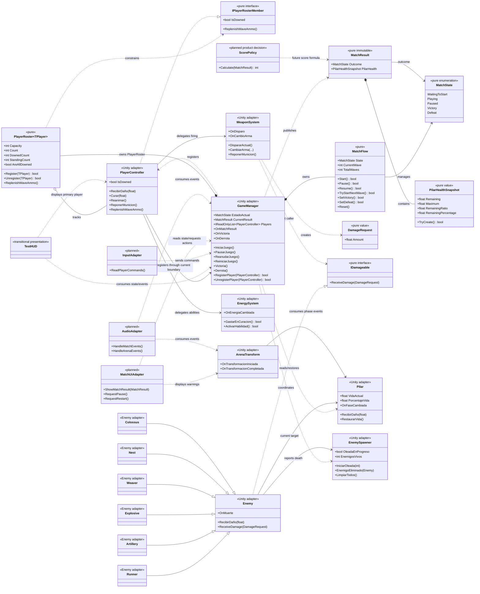

# Diagrama de clases planificado

Este diagrama muestra la estructura que vamos a construir de forma incremental. Separa las reglas puras de los adaptadores de Unity y deja explícitas las integraciones que todavía no vamos a implementar.

## Cómo leerlo

| Marca | Significado |
|---|---|
| `<<pure>>` | Código C# independiente de Unity, testeable sin escenas ni `MonoBehaviour`. |
| `<<Unity adapter>>` | Componente que conecta las reglas con Unity, física, tiempo o escena. |
| `<<transitional presentation>>` | Código existente que se mantendrá mientras se reemplaza por presentación desacoplada. |
| `<<planned>>` | Contrato conceptual; todavía no existe como implementación final. |
| `<<planned product decision>>` | No se implementa hasta definir la regla de producto correspondiente. |

## Orden de implementación

1. **Base pura existente:** `MatchState`, `MatchFlow`, `PlayerRoster`, `PilarHealthSnapshot`, `MatchResult`, `DamageRequest` e `IDamageable`.
2. **Adaptadores estabilizados:** `GameManager`, `PlayerController` y `Enemy` conservando sus APIs públicas actuales.
3. **Migración gradual:** `Pilar`, torretas, proyectiles, energía y demás receptores pasan a `IDamageable` sin cambiar reglas de gameplay accidentalmente.
4. **Presentación:** `MatchUiAdapter` y `AudioAdapter` consumen eventos; ningún adaptador de presentación modifica el estado interno.
5. **Input y features:** `InputAdapter`, variantes temporales de armas y cámaras se incorporan después de definir sus contratos.
6. **Puntaje:** `ScorePolicy` queda separado hasta acordar normalización, redondeo y tratamiento de victoria/derrota.

## Límites deliberados

- No se agregan todavía `PlayerInput`, asignación de dispositivos, cámaras split-screen, assets, escenas ni prefabs.
- No se inventa una razón de derrota nueva: el resultado actual expone únicamente `Victory` o `Defeat` y el estado factual del Pilar.
- `RecibirDaño(float)` se conserva como API de compatibilidad mientras se completa la migración a `IDamageable`.
- `TestHUD` no representa el HUD final ni intenta resolver la UX de cuatro jugadores.
- Las relaciones marcadas como `planned` describen dirección arquitectónica, no clases listas para conectar en una escena.
