# Diagrama de clases

Estructura implementada de Último Pilar. Separa las reglas puras de los adaptadores de Unity e incluye la presentación, el audio y las variantes ya implementadas; los diferidos explícitos están en los límites.

```mermaid
classDiagram
    direction LR

    class MatchState {
        <<pure enumeration>>
        WaitingToStart
        Playing
        Paused
        Victory
        Defeat
    }

    class MatchFlow {
        <<pure>>
        +MatchState State
        +int CurrentWave
        +int TotalWaves
        +Start() bool
        +Pause() bool
        +Resume() bool
        +TryStartNextWave() bool
        +SetVictory() bool
        +SetDefeat() bool
        +Reset()
    }

    class PilarHealthSnapshot {
        <<pure value>>
        +float Remaining
        +float Maximum
        +float RemainingRatio
        +float RemainingPercentage
        +TryCreate() bool
    }

    class MatchResult {
        <<pure immutable>>
        +MatchState Outcome
        +PilarHealthSnapshot PilarHealth
        +int Score
    }

    class IPlayerRosterMember {
        <<pure interface>>
        +bool IsDowned
        +ReplenishWaveAmmo()
    }

    class PlayerRoster~TPlayer~ {
        <<pure>>
        +int Capacity
        +int Count
        +int DownedCount
        +int StandingCount
        +bool AreAllDowned
        +Register(TPlayer) bool
        +Unregister(TPlayer) bool
        +ReplenishWaveAmmo()
    }

    class DamageRequest {
        <<pure value>>
        +float Amount
    }

    class IDamageable {
        <<pure interface>>
        +ReceiveDamage(DamageRequest)
    }

    class GameManager {
        <<Unity adapter>>
        +MatchState EstadoActual
        +MatchResult CurrentResult
        +IReadOnlyList~PlayerController~ Players
        +IniciarJuego()
        +PausarJuego()
        +ReanudarJuego()
        +ReiniciarJuego()
        +Victoria()
        +Derrota()
        +RegisterPlayer(PlayerController) bool
        +UnregisterPlayer(PlayerController) bool
        +OnMatchResult
        +OnVictoria
        +OnDerrota
    }

    class PlayerController {
        <<Unity adapter>>
        +bool IsDowned
        +OnCommandIssued
        +RecibirDaño(float)
        +Curar(float)
        +Reanimar()
        +ReponerMunicion()
        +ReplenishWaveAmmo()
    }

    class Pilar {
        <<Unity adapter>>
        +float VidaActual
        +float PorcentajeVida
        +RecibirDaño(float)
        +RestaurarVida()
        +OnFaseCambiada
    }

    class Enemy {
        <<Unity adapter>>
        +RecibirDaño(float)
        +ReceiveDamage(DamageRequest)
        +OnMuerte
    }

    class Runner {
        <<Enemy adapter>>
    }
    class Artillery {
        <<Enemy adapter>>
    }
    class Explosive {
        <<Enemy adapter>>
    }
    class Weaver {
        <<Enemy adapter>>
    }
    class Nest {
        <<Enemy adapter>>
    }
    class Colossus {
        <<Enemy adapter>>
    }

    class WeaponSystem {
        <<Unity adapter>>
        +DispararActual()
        +CambiarArma(...)
        +ReponerMunicion()
        +OnDisparo
        +OnCambioArma
    }

    class EnergySystem {
        <<Unity adapter>>
        +GastarEnCuracion() bool
        +ActivarHabilidad() bool
        +OnEnergiaCambiada
    }

    class EnemySpawner {
        <<Unity adapter>>
        +bool OleadaEnProgreso
        +int EnemigosVivos
        +IniciarOleada(int)
        +EnemigoEliminado(Enemy)
        +LimpiarTodos()
    }

    class ArenaTransform {
        <<Unity adapter>>
        +OnTransformacionIniciada
        +OnTransformacionCompletada
    }

    class PlayerJoinCoordinator {
        <<Unity composition>>
        +TryJoin(Gamepad) bool
    }

    class SplitScreenCameraCoordinator {
        <<Unity composition>>
        +ApplyViewports()
    }

    class Hud {
        <<Unity presentation>>
        +MostrarMensaje(string)
        +MostrarAdvertencia(string)
        +FlashCrosshair(bool)
    }

    class TestSceneSetup {
        <<Unity composition>>
        +InputActionAsset inputActionAsset
        +GenerarEscenaDePrueba()
    }

    class PlayerInput {
        <<Unity component>>
        +InputActionAsset actions
        +string defaultActionMap
        +string defaultControlScheme
        +bool neverAutoSwitchControlSchemes
    }

    class PlayerCommand {
        <<pure immutable value>>
        +float MoveX
        +float MoveY
        +float LookX
        +float LookY
        +bool Jump
        +bool Fire
        +bool Interact
        +bool Heal
        +bool Ability
        +bool PreviousWeapon
        +bool NextWeapon
        +int? WeaponSlot
    }

    class IInputAdapter {
        <<pure interface>>
        +bool IsEnabled
        +PlayerCommand CurrentCommand
        +Enable()
        +Disable()
    }

    class PlayerInputAdapter {
        <<Unity adapter>>
        +PlayerInput AssignedPlayerInput
        +InputAction JoinAction
        +Enable()
        +Disable()
    }

    class CombatFeedback {
        <<Unity presentation>>
        +NotifyShot(float)
        +NotifyHit(bool)
        +OnCombatHit
    }
    
    class WeaponVariantPickup {
        <<Unity adapter>>
        +OnRecogida
    }
    
    class AudioAdapter {
        <<Unity adapter>>
        +Play(Sfx)
    }

    class ScorePolicy {
        <<pure policy>>
        +Calculate(PilarHealthSnapshot) int
        +Calculate(float) int
    }

    MatchFlow --> MatchState : manages
    MatchResult *-- PilarHealthSnapshot : contains
    MatchResult --> MatchState : outcome
    MatchResult ..> ScorePolicy : computes Score
    ScorePolicy ..> PilarHealthSnapshot : reads factual percentage

    PlayerRoster~TPlayer~ ..> IPlayerRosterMember : constrains
    PlayerController ..|> IPlayerRosterMember
    Enemy ..|> IDamageable

    GameManager *-- MatchFlow : owns
    GameManager *-- PlayerRoster~TPlayer~ : owns PlayerRoster<PlayerController>
    GameManager ..> MatchResult : publishes
    GameManager ..> Pilar : reads/restores
    GameManager ..> EnemySpawner : coordinates
    GameManager ..> PlayerController : registers
    PlayerRoster~TPlayer~ o-- PlayerController : tracks

    PlayerController --> GameManager : registers and publishes command event
    PlayerController --> PlayerInputAdapter : reads one command snapshot per frame
    PlayerController --> WeaponSystem : consumes weapon command
    PlayerController --> EnergySystem : delegates abilities

    WeaponSystem ..> IDamageable : first caller
    WeaponSystem ..> DamageRequest : creates
    WeaponSystem ..> CombatFeedback : notifies shots
    WeaponVariantPickup --> WeaponSystem : applies variant
    Enemy ..> CombatFeedback : notifies hits/kills
    Enemy ..> WeaponVariantPickup : drops variant
    Enemy ..> PlayerController : targets nearest
    Enemy --> Pilar : current target
    Enemy --> EnemySpawner : reports death

    Runner --|> Enemy
    Artillery --|> Enemy
    Explosive --|> Enemy
    Weaver --|> Enemy
    Nest --|> Enemy
    Colossus --|> Enemy

    ArenaTransform --> Pilar : consumes phase events
    Hud ..> GameManager : consumes state/result/score
    Hud ..> PlayerController : displays every registered player
    Hud ..> MatchResult : shows score
    Hud ..> WeaponSystem : shows variant timer
    CombatFeedback ..> GameManager : shakes registered cameras
    Hud ..> CombatFeedback : subscribes OnCombatHit
    AudioAdapter ..> GameManager : consumes events
    AudioAdapter ..> CombatFeedback : consumes hits
    AudioAdapter ..> WeaponSystem : consumes shots
    AudioAdapter ..> EnergySystem : consumes heal/ability

    IInputAdapter ..> PlayerCommand : returns snapshots
    PlayerInputAdapter ..|> IInputAdapter
    PlayerInputAdapter ..> PlayerCommand : creates snapshots
    TestSceneSetup --> PlayerInput : configures primary player
    TestSceneSetup --> PlayerController : composes inactive, then activates primary
    TestSceneSetup --> PlayerJoinCoordinator : configures join and template
    TestSceneSetup --> SplitScreenCameraCoordinator : configures split-screen
    PlayerJoinCoordinator --> GameManager : registers joined players
    PlayerJoinCoordinator --> PlayerInput : pairs gamepads exclusively
    SplitScreenCameraCoordinator --> GameManager : reads roster order
    SplitScreenCameraCoordinator --> PlayerController : configures explicit cameras
```

## Cómo leerlo

| Marca | Significado |
|---|---|
| `<<pure>>` | Código C# independiente de Unity, testeable sin escenas ni `MonoBehaviour`. |
| `<<Unity adapter>>` | Componente que conecta las reglas con Unity, física, tiempo o escena. |
| `<<pure policy>>` | Regla determinista sin dependencia de Unity. |

## Orden de construcción

1. **Base pura existente:** `MatchState`, `MatchFlow`, `PlayerRoster`, `PilarHealthSnapshot`, `ScorePolicy`, `MatchResult`, `DamageRequest` e `IDamageable`.
2. **Adaptadores estabilizados:** `GameManager`, `PlayerController` y `Enemy` conservando sus APIs públicas actuales.
3. **Migración gradual de daño:** `Enemy` recibe y `WeaponSystem` llama vía `IDamageable`; `Pilar`, torretas, proyectiles y energía conservan `RecibirDaño(float)` como compatibilidad.
4. **Presentación:** `Hud` (filas por jugador, overlays, resultado con puntaje, crosshair, variante), `CombatFeedback` (shake + hitstop) y `AudioAdapter` (efectos procedurales) consumen eventos; ningún adaptador de presentación modifica el estado interno.
5. **Input y features:** `PlayerCommand`, `IInputAdapter` y `PlayerInputAdapter` definen la frontera por jugador. El consumidor primario ya enruta movimiento, mirada, salto, disparo, habilidades, interacción y selección de armas; `TestSceneSetup` configura el `PlayerInput` primario con el asset `Keyboard&Mouse` antes de activarlo. `PlayerJoinCoordinator` crea jugadores adicionales con gamepads independientes (Start/A) y `SplitScreenCameraCoordinator` configura las cámaras.
6. **Puntaje:** `ScorePolicy` convierte el porcentaje factual restante del Pilar a un entero entre 0 y 100, con redondeo al entero más cercano y midpoint hacia arriba; `MatchResult.Score` conserva ese resultado.

## Límites deliberados

- `PlayerInputAdapter` usa únicamente el `PlayerInput` asignado y el mapa `Player`; el jugador primario se configura con `Keyboard&Mouse` y el asset existente. No descubre dispositivos, crea jugadores ni coordina el join. El mapa `Join` conserva Start/A, es gamepad-only y queda expuesto para la integración futura.
- `PlayerJoinCoordinator` y `SplitScreenCameraCoordinator` ya están implementados y compuestos por `TestSceneSetup`: el primero crea jugadores adicionales con emparejamiento independiente de gamepads y el segundo configura cámaras split-screen por orden del roster.
- El lobby, el HUD por jugador separado, hotplug y el cambio de arma con rueda del mouse quedan diferidos; `Enemy` y `EnergyPickup` ya resuelven al jugador registrado más cercano.

- La derrota ocurre si el Pilar llega a cero o si todos los jugadores registrados están derribados; el resultado expone únicamente `Victory` o `Defeat`, el estado factual del Pilar y su `Score`, sin agregar una causa de derrota.
- `RecibirDaño(float)` se conserva como API de compatibilidad mientras se completa la migración a `IDamageable`.
- `Hud` es el HUD definitivo: consume `OnMatchResult` y el roster, muestra hasta cuatro jugadores, overlays de inicio/pausa/resultado con puntaje, crosshair con flash y timer de variante temporal.
